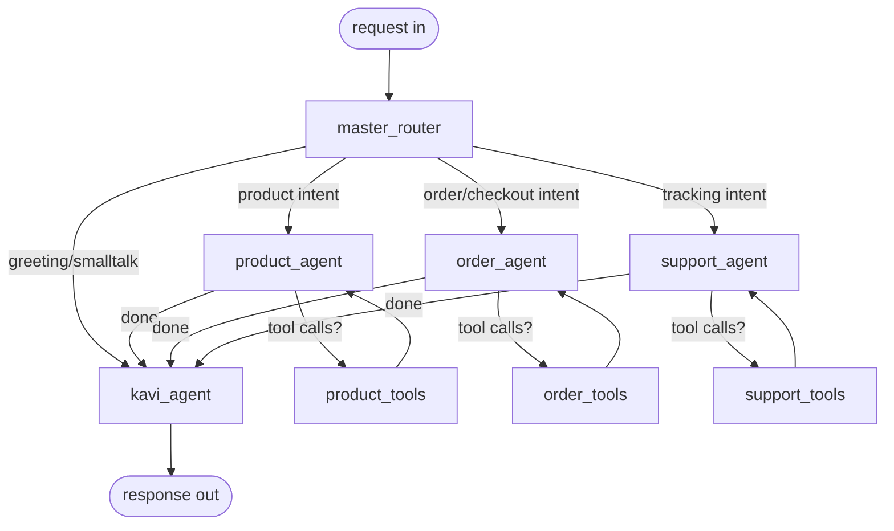
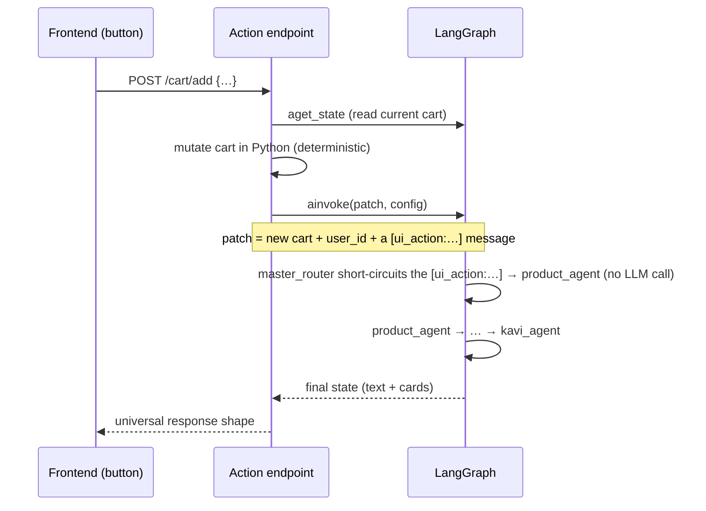

# Kavi — Agent Operations & Customer Interaction Pathways

This document describes how the **Kavi** shopping-assistant backend actually operates: the
graph, the agents, the API surface, and — the main focus — the **distinct pathways a customer
can take through the workflow**, including both conversational (typed) and UI-driven (button /
form) interactions.

> Companion docs: `TASKS.md` (build history & rationale), `CLAUDE.md` (project brief & rules).

---

## 1. What Kavi is

A multilingual (English / Sinhala / Tamil), agentic shopping assistant for Kapruka.com.
Built on **FastAPI + LangGraph + LangChain**, using **Google Gemini** models, backed by
**Postgres** (LangGraph checkpointer + cross-thread store) and the **Kapruka MCP** server for
real product/delivery/order operations.

> **Kapruka is a broad online marketplace** — thousands of products across many categories
> (electronics, groceries, books, fashion, home & kitchen, beauty, baby, …) **as well as** the
> gifting range (cakes, flowers, hampers). The live category list is fetched from Kapruka at
> startup and handed to `product_agent`, so Kavi shops the **whole** catalogue — it is not a
> gifting-only bot. The examples in this doc deliberately span everyday shopping and gifting;
> some features (notably the automatic cross-sell in Pathway D3) are currently tuned for the
> gifting categories, which is called out where relevant.

Two identities flow on every request:

| Field | Scope | Purpose |
|-------|-------|---------|
| `user_id` | The person (stable, from a browser cookie/localStorage) | Cross-thread memory — past orders & searches |
| `thread_id` | One conversation | Per-conversation message history & cart/checkout state |

Both are sent explicitly by the frontend on **every** call; nothing is derived by string-splitting.

---

## 2. The graph (LangGraph `StateGraph`)



- **`master_router`** — classifies the latest message: picks the next agent and detects the
  language. Calls **no** tools. Uses `suggested_next_step` from the previous turn as a
  disambiguation hint for short replies ("yes", "sure", "do it"). **Cart-routing rule:** any
  cart change (add / remove / change quantity — typed *or* button) always routes to
  `product_agent`, even mid-checkout and even when phrased as "buy"/"order this";
  `order_agent` is reserved for delivery checks, collecting checkout details, and placing the
  order. (Enforced in both the router prompt and `RouterDecision.next_agent`'s description.)
- **Specialist agents** (`product_agent`, `order_agent`, `support_agent`) — each can call its
  own tools in a loop (`agent → tools → agent → …`) until it has what it needs.
- **`kavi_agent`** — the single final voice. Has **no tools**. It rewrites whatever the
  specialist produced into one warm, on-brand reply, attaches the **cards**, and computes the
  **suggested next step**. The customer only ever sees Kavi's text.

> Not shown in the diagram: `route_after_master_router` also has a `→ END` fallback for the case
> where `selected_agent` is somehow none of the four agents. Because the router uses structured
> output (`RouterDecision.next_agent` is a `Literal` of exactly the four agents), this branch is
> **effectively unreachable** — it's defensive only. (See `PERFORMANCE.md` for the suggestion to
> default it to `kavi_agent` so a turn can never end without a reply.)

Every node is wrapped by a `log_node` decorator: it logs entry trigger (typed / tool result /
`[ui_action:…]`), tool calls requested, truncated tool results, and elapsed time.

---

## 3. API surface (entry points)

| Method & path | Purpose | Body |
|---------------|---------|------|
| `POST /chat` | Buffered chat turn | `{user_id, thread_id, message}` |
| `POST /chat/stream` | Streaming chat turn (SSE) | `{user_id, thread_id, message}` |
| `POST /cart/add` | Add product (button) | `{user_id, thread_id, product_id, name, quantity, unit_price?, currency?, image_url?, icing_text?, in_stock?}` |
| `POST /cart/remove` | Remove a line (button) | `{user_id, thread_id, product_id}` |
| `POST /cart/update_qty` | Change quantity (button/stepper) | `{user_id, thread_id, product_id, quantity}` |
| `POST /cart/clear` | Empty the cart (button) | `{user_id, thread_id}` |
| `POST /checkout/submit` | Submit the checkout form | `{user_id, thread_id, recipient_name?, recipient_phone?, delivery_address?, delivery_city?, delivery_date?, delivery_location_type?, delivery_instructions?, sender_name?, sender_anonymous?, gift_message?}` |
| `GET /` , `GET /health` | Liveness | — |

**All** of these resolve to the **same response shape** (see §6), so the frontend never needs a
special case for "button reply" vs "typed reply".

---

## 4. Core concepts

### 4.1 Conversation state (`ShoppingState`)
Carried per `thread_id`, persisted by the Postgres checkpointer:

| Field | Meaning |
|-------|---------|
| `messages` | Full chat history (reduced by `add_messages`) |
| `selected_agent` | Which specialist the router chose |
| `language` | `English` \| `Sinhala` \| `Tamil` |
| `user_id` | The customer (so tools can reach it via `InjectedState`) |
| `cart` | List of `CartItem` |
| `checkout` | In-progress `CheckoutData` (recipient/delivery/sender/gift) or `None` |
| `delivery_confirmed` | Gate flag — only true after a successful delivery check |
| `suggested_next_step` | Deterministic next-step hint (see §4.3) |
| `cards` | Frontend cards for this turn |
| `user_context` | Returning-customer history, loaded once on a new thread (see Pathway H) |
| `cross_sold_categories` | Product-category prefixes already cross-sold this thread, so a "you might also like" never repeats the same category (see Pathway D3). Reset to `[]` when the cart is cleared. |

`cart`, `checkout`, `delivery_confirmed`, and `cross_sold_categories` have **reducers** so two
concurrent tool writes in one graph step merge instead of crashing (defense-in-depth against
parallel tool calls).

### 4.2 Cards (visual payload)
Cards are built **deterministically in Python** (`cards.py`), never by the LLM — so their facts
are always correct. Kavi's text is told *not* to repeat what's on a card.

| Card `type` | Built from | Shows |
|-------------|-----------|-------|
| `product` | search / get_product results | image, name, price, stock, summary, link |
| `cart_summary` | current cart | line items, quantities, totals |
| `checkout_form` | `checkout` state | filled fields + `missing_fields` list |
| `checkout_confirmation` | `place_order` success | order ref, totals, pay link, expiry |
| `order_tracking` | track_order result | status, progress timeline, media flags |

### 4.3 `suggested_next_step` (deterministic nudge + routing hint)
Recomputed **every turn** by a plain rule (`cart.compute_suggested_next_step`), purely from
cart/checkout state. In practice it emits one of `continue_checkout` · `proceed_to_checkout` ·
`add_more` · `null`:
- in-progress checkout → `continue_checkout` (or `null` once all fields are filled **and** delivery is
  confirmed — i.e. ready to place the order),
- 2+ items and no fresh product card surfaced this turn → `proceed_to_checkout`,
- otherwise a non-empty cart → `add_more`; empty cart and no checkout → `null`.

> The `SuggestedNextStep` type (`schemas.py`) also defines `browse_categories` and `track_order`, and
> the router is told how to interpret them as disambiguation hints — but the **current deterministic
> rule never emits them** (they're reserved for future nudges). Treat the four values above as the live set.

It is used three ways: (1) Kavi phrases it in its own voice, (2) the router uses it to interpret
short follow-ups, (3) the frontend can render it as a **quick-action button**.

One subtlety: when this turn surfaced a **fresh product card** (from a search *or* a cross-sell
suggestion), a 2+-item cart is deliberately kept at `add_more` instead of `proceed_to_checkout`.
Otherwise an ambiguous "yes" — meaning "yes, add that one you just showed me" — would be routed
by the router's disambiguation hint to `order_agent` (checkout) instead of back to `product_agent`
(add). An in-progress checkout always takes priority over this rule.

### 4.4 Persistence
- **Checkpointer** (`AsyncPostgresSaver`) — per-`thread_id` conversation/cart/checkout state.
- **Store** (`AsyncPostgresStore`) — cross-thread, per-`user_id` memory under namespaces
  `(user_id, "orders")` and `(user_id, "searches")`. Both share **one** connection pool.

### 4.5 Concurrency safety
Every read-modify-write-resume sequence (chat turns **and** action endpoints) is guarded by a
per-`thread_id` `asyncio.Lock`, so a button click and an in-flight chat call for the same thread
can't interleave checkpoint writes.

---

## 5. Agents & tools at a glance

| Agent | Tools it can call | Notes |
|-------|-------------------|-------|
| `master_router` | none | routing + language detection only |
| `product_agent` | `kapruka_search_products`, `kapruka_get_product`, `add_to_cart`, `remove_from_cart`, `update_cart_quantity`, `clear_cart` | history-based suggestions (Pathway H) + cart-based cross-sell (Pathway D3) |
| `order_agent` | `update_checkout_info`, `check_delivery_for_city`, `place_order`, + the 4 cart tools | owns the gated checkout sequence |
| `support_agent` | `kapruka_track_order` | tracking only |
| `kavi_agent` | none | final synthesis + cards |

**Deliberately NOT exposed to any LLM:** the raw `kapruka_list_delivery_cities`,
`kapruka_check_delivery`, and `kapruka_create_order` tools. They're reachable only through the
composite, **gated** tools `check_delivery_for_city` and `place_order`, so the
canonical-city-resolution and order-readiness gates can never be bypassed.

> **Why `order_agent` also has the 4 cart tools:** they're a **fallback**, not its primary
> job. The router's cart-routing rule (§2) sends pure cart edits to `product_agent`, so
> `order_agent` only needs to touch the cart when a change arrives **bundled** with checkout
> intent in one message (e.g. "remove the cake and send it to Amal in Kandy") — it handles
> that edit inline instead of re-routing, then continues the checkout flow.

---

## 6. The universal response shape

Returned by `/chat`, every `/cart/*`, and `/checkout/submit` (and, as the `final` SSE event, by
`/chat/stream`):

```json
{
  "user_id": "u_123",
  "thread_id": "t_abc",
  "text": "Oh, you have great taste! That chocolate truffle cake is a customer favourite…",
  "cards": [ { "type": "product", "...": "..." }, { "type": "cart_summary", "...": "..." } ],
  "suggested_next_step": "proceed_to_checkout",
  "selected_agent": "product_agent",
  "language": "English"
}
```

---

## 7. Customer interaction pathways

Each pathway below is something a real customer does. Pathways combine freely in one
conversation (the cart and checkout state persist across all of them on the same `thread_id`).

### Pathway A — Greeting / small talk
`POST /chat` "Hi!" → router → **kavi_agent** (no specialist needed) → friendly reply. If the
customer is a returning one, this is also where the **welcome-back** happens (Pathway H).

### Pathway B — Discovery & search (typed)
```
POST /chat  "show me wireless earbuds under 10000"   (any category — electronics, books, etc.)
  → master_router → product_agent
  → product_agent calls kapruka_search_products (response_format forced to json)
  → product_tools → product_agent (drafts) → kavi_agent
  ← text + [product cards] + suggested_next_step="add_more"
```
- The search query is also written to the customer's `(user_id, "searches")` history,
  deterministically, regardless of what the model says.
- Categories: if the customer asks "what categories do you have?", the agent answers from the
  pre-loaded category list (no tool call). The full Kapruka catalogue is searchable, not just gifts.

### Pathway C — Product details (typed)
```
POST /chat  "tell me more about the second one"
  → product_agent → kapruka_get_product → product card with full details
```

### Pathway D — Add to cart
Two equivalent ways in, **same** state and downstream reaction:

**D1 — Typed:**
```
POST /chat  "add 2 of that to my cart"
  → product_agent → add_to_cart tool (validates stock/qty, mutates cart)
  → kavi_agent ← "Added! …" + cart_summary card + suggested_next_step
```

**D2 — Button on a product card:**
```
POST /cart/add  {product_id, name, quantity, unit_price, …}
  1. endpoint mutates the cart in Python (cart.add_item) under the thread lock
  2. runs a normal turn: ainvoke(patch, config) with a synthetic [ui_action:add_to_cart] {…}
     message; master_router short-circuits it to product_agent (no LLM call)
  3. product_agent SEES the action already happened (it does NOT re-verify) and reacts
  → kavi_agent ← same shape as D1
```
> The `[ui_action:…]` event is what lets the agent *react in natural language* to a button
> click instead of silently mutating state. See §8 for the resume mechanism.

**D3 — Automatic cross-sell ("you might also like"):**
Whenever an add just happened (typed **or** button) **and** checkout hasn't started yet,
`product_agent` proactively suggests one complementary product — e.g. add a cake → it offers
flowers. This is deterministic, not LLM-guessed:
```
add detected this turn  +  checkout is None
  → cart.find_complementary_suggestion(cart, cross_sold_categories)
      • maps the first cart item's product_id prefix to a complementary search term:
          CAKE→flowers · FLOWER→chocolates · COMBO→greeting card ·
          CHOCOLATES→flowers · GREETING→chocolates   (cart.COMPLEMENTARY_AFFINITY)
      • skips any prefix already in cross_sold_categories (never repeats a category)
  → product_agent is instructed to call kapruka_search_products(q=<term>) ONCE and present
    the result as a "you might also like" — not as what the customer asked for
  → the prefix is appended to cross_sold_categories
  → kavi_agent ← cart_summary card + a fresh product card, framed clearly as an extra idea
                 ("pairs nicely with…"), distinct from the add confirmation
```
- It fires **only in the pre-checkout browsing phase** (once `order_agent` opens `checkout={}`,
  cross-sell stops — Pathway F takes over).
- The fresh product card it surfaces also keeps `suggested_next_step` at `add_more` for this turn
  (see §4.3), so a following "yes" adds the suggested item rather than jumping to checkout.
- Distinct from Pathway H: cross-sell keys off the **current cart** (this thread); Pathway H keys
  off the customer's **past orders/searches** (cross-thread history). On a turn where cross-sell
  fires, the history-based hint is suppressed so the model gets exactly one recommendation signal.
- Clearing the cart (`/cart/clear` or `clear_cart`) resets `cross_sold_categories`, so cross-sell
  starts fresh for the next cart.
- **Scope (important):** the affinity map currently covers only the **gifting** prefixes
  (CAKE/FLOWER/COMBO/CHOCOLATES/GREETING). For everyday marketplace items (a charger, rice, a
  book, a dress), `find_complementary_suggestion` returns `None`, so **no** "you might also like"
  fires — those just flow search → add → checkout. The map is a plain Python dict, so extending
  cross-sell to other categories later is a one-line-per-pair change with no graph changes.

### Pathway E — Manage the cart (remove / change qty / clear)
Typed ("actually make it 3", "remove the cake") → routed to **`product_agent`** (per the §2
cart-routing rule, even mid-checkout) and handled by `update_cart_quantity` /
`remove_from_cart` / `clear_cart`. Button equivalents → `POST /cart/update_qty`,
`/cart/remove`, `/cart/clear`. (When a cart edit is bundled into a checkout-intent message,
`order_agent` handles it inline with the same tools — see §5.) Invalid operations (e.g.
removing an item not in the cart) raise a `CartError` that surfaces as a friendly message,
never a raw error.

### Pathway F — Checkout (collect delivery details)
The moment there's a cart and no checkout has started, `order_agent` **auto-initializes**
`checkout = {}`, which makes the **checkout form card** (with its `missing_fields` list) appear.
Two input routes, same destination:

**F1 — Conversational, a few fields at a time:**
```
POST /chat  "send it to Amal, 0771234567, 123 Lake Rd, on 2026-06-25, I'm Nimal"
  → order_agent → update_checkout_info (merges fields into checkout)
  → kavi_agent ← "Got it! I still need your delivery city" + updated checkout_form card
```

**F2 — Structured form submit:**
```
POST /checkout/submit  {recipient_name, recipient_phone, delivery_address,
                        delivery_city, delivery_date, sender_name, …}
  1. endpoint merges all non-city fields into checkout (checkout.merge_checkout)
  2. delivery_city is NOT merged directly — it's flagged as city_to_resolve so it must
     still go through canonical resolution (F3), exactly like a typed city
  3. runs ainvoke(patch, config) with a [ui_action:checkout_form_submit] {…} message;
     master_router short-circuits it to order_agent (no LLM call)
```

**F3 — City resolution + delivery check (always via one composite tool):**
```
order_agent → check_delivery_for_city("Colombo")
  • internally calls kapruka_list_delivery_cities → resolves the canonical name
    (exact/alias/single-match only; otherwise asks the customer to disambiguate)
  • then calls kapruka_check_delivery for the date already on file
  • sets checkout.delivery.city + delivery_confirmed accordingly
```
The city is **only ever** set this way — a raw/typo'd city string can never satisfy the
"field present" check without being validated as deliverable.

### Pathway G — Place the order (gated)
```
POST /chat  "place the order"
  → order_agent → place_order()   (zero-argument; reads cart/checkout/delivery_confirmed
                                    from state — the LLM never reconstructs the payload)
  • GATE: checkout.is_ready_for_order(cart, checkout, delivery_confirmed)
      - cart non-empty?
      - all required fields present?
      - delivery_confirmed == true?
  • if not ready → friendly "still need X" message, no API call
  • if ready → kapruka_create_order → on success:
      - writes the order (incl. cart items) to (user_id, "orders")
      - resets cart=[], checkout=None, delivery_confirmed=False
      - returns a checkout_confirmation card (order ref, totals, pay link)
  • on a create_order error code → mapped to a specific friendly message
    (e.g. city_not_deliverable, product_out_of_stock) — never the raw "Error (code): …"
```

### Pathway H — Returning customer (personalization)
On the **first turn of a brand-new thread** (`graph.aget_state` returns empty), `/chat` and
`/chat/stream` read the customer's `(user_id, "orders")/latest` and
`(user_id, "searches")/recent` from the Store, summarize them, and seed `user_context`. It is
**not** re-queried on later turns (it rides along in checkpointed state).

That context drives two things:
- **kavi_agent** may open with a brief, natural *welcome back* (only at conversation start).
- **product_agent** proactively **suggests items based on purchase history** — recommending
  things that complement or relate to what the customer bought/searched before (e.g. previously
  ordered a cake → suggest a matching bouquet or a fresh cake for an upcoming occasion). It does
  **not** auto-repeat a past order — there is no "order the usual" shortcut; this is about smart
  suggestions only. (This is the *cross-thread, history-based* sibling of the *current-cart-based*
  cross-sell in Pathway D3 — the two are kept from firing together on the same turn.)

### Pathway I — Order tracking
```
POST /chat  "track order VIMP34456CB2"
  → master_router → support_agent → kapruka_track_order → order_tracking card
```
`support_agent` distinguishes the **post-payment order number** (from the confirmation email)
from the **pre-payment order ref** (the checkout link), and asks for the right one if needed.

### Pathway J — Quick-action button (closing the loop)
The `suggested_next_step` returned each turn can be rendered as a tappable button
("Proceed to checkout →"). Tapping it is just another request through the normal pathways
(e.g. a `/chat` "let's check out" or a `/cart/*` action), so the suggestion the agent makes and
the action the customer takes use the same machinery.

### Pathway K — Streaming vs buffered response (a transport choice, not a different flow)
Any chat turn can be requested buffered (`/chat`) or streamed (`/chat/stream`). The streaming
endpoint emits Server-Sent Events:

| SSE `event` | When | Payload |
|-------------|------|---------|
| `status` | immediately (`received`), then once per node as it finishes | `{agent, status}` |
| `token` | as Kavi writes the final reply | `{text}` (incremental) |
| `final` | end of turn | `{cards, suggested_next_step, selected_agent, language}` |
| `error` | on failure | `{text}` (friendly) |

Only **kavi_agent**'s tokens are streamed as `token` events (filtered by the LangGraph
`langgraph_node` metadata) — specialist drafts and every raw tool call/result are filtered out,
so the frontend only ever sees the polished reply, never internal reasoning. Verified at the
wire level against a real server: first byte (~immediate ack) → status events as nodes finish →
incremental tokens → `final`.

> Frontend note: consume `/chat/stream` as a stream (`fetch` + `ReadableStream` or `EventSource`-
> style parsing), switching on the `event` field — **not** `await response.json()`.

---

## 8. The UI-action mechanism (how buttons re-enter the graph)

Every button/form endpoint mutates state deterministically, then runs a normal graph turn with a
synthetic `[ui_action:…]` message — the **same** `graph.ainvoke(patch, config)` call `/chat` uses:



How the router short-circuits: `master_router_node` checks the latest message first
(`schemas.parse_ui_action_type`). If it's a `[ui_action:…]` event, the node **returns the mapped
agent immediately** without building its prompt or calling the router model —
`checkout_form_submit` → `order_agent`, every other (cart) action → `product_agent`
(`agent._UI_ACTION_AGENT`). A button click carries no ambiguity, so there's nothing for the LLM to
decide; `language` is left untouched (a click carries none). The mapped specialist then runs as a
**real, full node** — it can still call tools and reach Kavi — so the customer gets a natural-language
reaction, not a silent state mutation.

> This replaced an earlier `aupdate_state(as_node="master_router") + ainvoke(None)` resume trick
> (Sprint 8). Behaviour is identical — no LLM routing call for UI actions either way — but routing now
> lives in one place (`master_router_node`), all entry points call the graph the same way, and UI
> actions log a standard `[master_router] enter | trigger=ui_action` line.

---

## 9. Resilience & safety

- **Graceful errors everywhere**: every Kapruka MCP call is wrapped — on failure the customer
  gets a friendly Kavi message (e.g. "Aiyo, our catalogue is briefly unavailable…"), never a
  stack trace. `/chat` and `/chat/stream` have top-level fallbacks. The place-order failure
  message explicitly reassures that **nothing was charged**.
- **Deterministic over LLM judgment**: cart math, city resolution, the order-readiness gate,
  card building, history writes, error-code → message mapping, **and which complementary category
  to cross-sell** are all plain Python — the LLM decides *what the customer wants* and does the
  talking, not *whether the order is valid* or *what counts as a valid cross-sell search term*.
- **No tool internals leak**: Kavi is the only customer-facing text; raw tool JSON, agent
  drafts, and tool-call chatter never reach the frontend (buffered or streamed).

---

## 10. Languages (and switching mid-journey)

`language` (English / Sinhala / Tamil) is **re-evaluated by the router on every typed `/chat`
turn** from the latest customer message — it is **not** locked at the start of the conversation.
A customer can switch languages at any point, and the switch takes effect **on the same turn**:

- The router detects the latest message's language and writes it into `state["language"]` (the
  field has no reducer — newest value wins). Every specialist and Kavi read `state.get("language")`
  fresh each turn, so they all immediately respond in the new language.
- **Romanized** Sinhala/Tamil counts as Sinhala/Tamil — it detects the *language*, not the script
  (e.g. "mata oya cake eka ganna ona" switches the conversation to Sinhala).
- **Anti-thrash guard**: for short/ambiguous messages ("yes", "ok", "2", a bare product id) the
  router is told to **keep the current language** rather than flip to English — so the language
  only changes on a message with real linguistic signal.
- The chosen language **persists** across turns (via the checkpointer) until the customer switches
  again.
- **Button/form actions don't reset language**: a UI action runs `master_router_node`, but it
  short-circuits the `[ui_action:…]` event to the mapped agent *without* the LLM detection step and
  never patches `language`, so a tap keeps whatever language was last detected (a click carries no
  language of its own).
- Only these three languages are supported; the router's structured output is constrained to them,
  so an unsupported language is mapped to the closest of the three rather than passed through.

Kavi is additionally instructed to use natural, warm, spoken-style Sinhala/Tamil (not stiff written
forms), keeping product names/IDs as-is.

---

## 11. Real-world customer use cases

Narrative walk-throughs of real customers, deliberately spanning the **whole marketplace** (not
just gifting) and every pathway from §7. Each line is a turn; the arrows show what the system does
and what the customer gets back.

### Use case 1 — Everyday purchase: phone accessory (English, buffered `/chat`)
A commuter needs a charger before a trip.
- Customer: *"I need a USB-C fast charger for my Samsung, under Rs 4000."*
  → search the catalogue → 3–4 charger **product cards**; `suggested_next_step=add_more`.
- Customer: *"the 25W one, add it."* → `add_to_cart` → **cart_summary card**.
  → **No cross-sell** (electronics has no affinity entry) — Kavi simply nudges toward checkout.
- Customer: *"checkout."* → **checkout_form card** → gives their own name/phone/address/date →
  city resolved + delivery confirmed (Pathway F) → *"place it."* → **checkout_confirmation card**
  with the pay link (Pathway G). Pure marketplace flow, zero gifting.

### Use case 2 — Sending a birthday gift, with cross-sell (English)
The one flow where the gifting cross-sell shines.
- Customer: *"I want to send a birthday cake to my friend in Kandy."* → cake **product cards**.
- Customer taps **Add to cart** on a cake (`/cart/add`, Pathway D2) → cart updated → **cross-sell
  (D3)**: Kavi surfaces a fresh flowers **product card** — *"these roses would pair beautifully 💐."*
- Customer: *"yes, add the roses too."* → second item added; cross-sell may now offer chocolates.
- Customer: *"that's everything, check out."* → recipient = the **friend** (not the buyer),
  delivery to **Kandy**, a gift message → delivery confirmed → order placed.
- Two days later: *"track my order"* → `support_agent` asks for the email order number →
  **order_tracking card** (Pathway I).

### Use case 3 — Multi-item grocery run (Sinhala)
Weekly shopping, in Sinhala.
- Customer (romanized Sinhala): *"mata Ceylon tea, basmati rice, saha sugar tika ona."*
  → router detects **Sinhala** → searches each → grocery **product cards** → Kavi replies in
  natural spoken Sinhala.
- Customer adds three items → 2+ items in cart → `proceed_to_checkout` → delivery to their **own**
  home address → order placed. No gifting, no cross-sell — everyday marketplace shopping, end to end.

### Use case 4 — Returning customer, cross-thread memory (English, Pathway H)
A customer who previously bought a **rice cooker** returns days later on a **new thread**.
- Customer: *"hey"* → first turn of a new thread → `user_context` loaded from the Store →
  Kavi: *"Welcome back! 🙂 Hope the rice cooker's working out — anything for the kitchen today,
  or something else?"* (history-based suggestion; this is **cross-thread**, distinct from D3).
- Customer then searches normally for whatever they came for.

### Use case 5 — Frontend-driven, streaming UX (`/chat/stream`, Pathways D2 + J + K)
A polished web session with cards and buttons.
- The browser renders product cards from a search; the customer taps **Add to cart** buttons
  (`/cart/add`) and then the **"Proceed to checkout →"** quick-action button rendered from
  `suggested_next_step` (Pathway J).
- Every reply is requested over `/chat/stream`, so the UI shows a *"Kavi is typing…"* ack
  immediately, then streams the text token-by-token (`status → token → final` events), with the
  cards arriving on the `final` event. Internal tool calls/drafts never reach the browser.

### Use case 6 — When something breaks (resilience, §9)
- Mid-search the Kapruka catalogue is briefly unreachable → the customer sees *"Aiyo, I'm having a
  little trouble reaching our product catalogue right now 😅 — try again in a moment?"* — never a
  stack trace. A retry succeeds.
- If a final order placement ever fails, the message explicitly states **nothing was charged**, so
  the customer never double-pays out of fear.

### Use case 7 — Order tracking (Tamil, Pathway I)
- Customer (Tamil): *"என் ஆர்டர் எங்க இருக்கு?"* → router detects **Tamil** → `support_agent`
  asks for the order number from the confirmation **email** (not the pre-payment ref) →
  `kapruka_track_order` → **order_tracking card** with the status timeline → reply in natural Tamil.

### Use case 8 — Mixed cart: gift + something for myself (English)
Shows the cart and checkout handling several products at once.
- Customer searches and adds a **hamper** for a colleague, then *"also add that paperback I was
  looking at"* (a book — different category). Cart now holds two unrelated items.
- At checkout, everything ships to one recipient/address in a single order (Pathway G) —
  the cart and `create_order` handle multiple line items regardless of category.

### Use case 9 — Switching language mid-journey (English → Sinhala → English, §10)
The customer starts in one language and changes partway through; the cart/checkout state is
untouched by the switches — only the wording changes.
- Customer: *"show me coffee mugs"* → router detects **English** → product cards, reply in English.
- Customer: *"meka mata ganna ona, cart ekata danna"* (Sinhala) → router detects **Sinhala** this
  turn → `add_to_cart` runs → Kavi confirms **in Sinhala**, same turn.
- Customer: *"ok"* → ambiguous → router **keeps Sinhala** (anti-thrash) → reply stays Sinhala.
- Customer: *"actually, can you check delivery to Galle?"* → router detects **English** again →
  `order_agent` + Kavi respond in English. No re-translation of state — the switch is purely in
  how Kavi talks.

---

## 12. Frontend integration guide

How a web/mobile client should talk to this backend and render what comes back. The golden rule:
**render structure from `cards`, never by parsing Kavi's `text`** — Kavi's prose is deliberately
written *not* to repeat the facts already on the cards, so the cards are your only complete source
of product/cart/checkout truth.

### 12.1 Identity: what to send on every request
| Field | Where the frontend keeps it | Rules |
|-------|-----------------------------|-------|
| `user_id` | `localStorage` (a stable UUID minted once per browser) | Same value forever → unlocks cross-thread **welcome-back** + history suggestions (Pathway H). Never regenerate it. |
| `thread_id` | `localStorage`, one per conversation (a fresh UUID when the user starts a "new chat") | All cart/checkout state lives under this. Reuse it for the whole conversation; mint a new one to start over. |

Both go in the JSON body of **every** call (chat *and* actions). Nothing is derived server-side by
string-splitting.

> **Order of operations:** the action endpoints (`/cart/*`, `/checkout/submit`) `404` if the thread has
> no state yet (`"start chatting before using this action."`). So the **first** interaction on a new
> `thread_id` must be a `/chat` or `/chat/stream` turn. After that, actions and chat can interleave freely.

### 12.2 Which endpoint to use
- **Live chat UI → `POST /chat/stream`** (SSE). Best perceived speed: a typing indicator appears
  immediately, text streams in token-by-token, cards arrive at the end.
- **`POST /chat`** — buffered single JSON. Use for non-streaming clients, server-to-server, or testing.
- **`/cart/*` and `/checkout/submit`** — button/form actions. Each returns the **same universal shape**
  as `/chat` (§6), so you reuse one render path for typed replies and button replies alike.

### 12.3 Consuming `/chat/stream` (SSE over POST)
Because the request needs a JSON body, use `fetch` + a `ReadableStream` reader — **not** the
`EventSource` API (it's GET-only). Parse `data: {json}\n\n` frames and switch on `event`:

```js
async function streamChat({ user_id, thread_id, message }, on) {
  const res = await fetch(`${API}/chat/stream`, {
    method: "POST",
    headers: { "Content-Type": "application/json" },
    body: JSON.stringify({ user_id, thread_id, message }),
  });
  const reader = res.body.getReader();
  const decoder = new TextDecoder();
  let buffer = "";
  while (true) {
    const { value, done } = await reader.read();
    if (done) break;
    buffer += decoder.decode(value, { stream: true });
    const frames = buffer.split("\n\n");
    buffer = frames.pop();                       // keep the trailing partial frame
    for (const frame of frames) {
      const data = frame.split("\n").find(l => l.startsWith("data:"));
      if (data) on(JSON.parse(data.slice(5).trim()));
    }
  }
}
```

The event sequence and how to handle each:

| `event` | Payload | Frontend action |
|---------|---------|-----------------|
| `status` | `{agent, status}` | Show a progress/typing indicator. `status` ∈ `received` → `thinking` → `browsing_products` / `working_on_checkout` / `checking_order` → `writing_reply`. (Tool nodes are filtered out — never shown.) |
| `token` | `{text}` | **Append** the delta to the current assistant bubble (these are Kavi's words only). |
| `final` | `{user_id, thread_id, cards, suggested_next_step, selected_agent, language}` | Stop the indicator; render `cards`; render the `suggested_next_step` quick-action button. (No `text` here — you already streamed it.) |
| `error` | `{text}` | Show `text` as the assistant message (it's already a friendly Kavi line, never a stack trace). |

For `POST /chat` you instead get the whole universal shape (§6) in one JSON response — `text` plus
`cards` plus the metadata — and render it the same way, minus the streaming.

### 12.4 Card shapes (render these; they're authoritative)
Every card has a `type` discriminator. Switch on it. Exact fields (from `schemas.py`):

**`product`** — from a search or product-details turn (and cross-sell suggestions):
```json
{ "type":"product", "product_id":"CAKE001", "name":"Chocolate Truffle Cake",
  "image_url":"https://…", "price":2500.0, "compare_at_price":null, "currency":"LKR",
  "in_stock":true, "stock_level":null, "summary":"Rich…", "url":"https://kapruka.com/…" }
```
Render an image, name, price (strike `compare_at_price` if present and higher), stock badge, and an
**Add to cart** button → §12.5. If `in_stock` is false, disable the add button.

**`cart_summary`** — current cart, returned on any cart-affecting turn:
```json
{ "type":"cart_summary", "items":[
    { "product_id":"CAKE001","name":"…","image_url":"…","unit_price":2500.0,
      "quantity":2,"line_total":5000.0,"in_stock":true } ],
  "items_total":5000.0, "currency":"LKR" }
```
(`items_total`/`line_total` are `null` if any item lacks a `unit_price` — show "—" then.) Each line
gets a qty stepper → `/cart/update_qty`, a remove → `/cart/remove`, and the card a clear → `/cart/clear`.

**`checkout_form`** — appears the moment checkout starts (cart exists). Drives your form:
```json
{ "type":"checkout_form",
  "fields": { "recipient":{"name":"…","phone":"…"},
              "delivery":{"address":"…","city":"…","date":"…","location_type":"…","instructions":"…"},
              "sender":{"name":"…","anonymous":false}, "gift_message":"…" },
  "missing_fields": ["recipient.phone","delivery.city","delivery.date"] }
```
Pre-fill inputs from `fields`; highlight everything in `missing_fields` (dotted paths). Submit → §12.5.

**`checkout_confirmation`** — order placed successfully:
```json
{ "type":"checkout_confirmation", "checkout_url":"https://pay.kapruka…", "order_ref":"VIMP…",
  "items_total":5000, "delivery_fee":350, "addons_total":0, "grand_total":5350,
  "currency":"LKR", "expires_at":"2026-06-21T12:00:00Z" }
```
Render the totals breakdown and a prominent **Pay now** button → open `checkout_url` (external Kapruka
payment page — *not* a backend call). Optionally show a countdown to `expires_at`.

**`order_tracking`** — from a tracking turn:
```json
{ "type":"order_tracking", "order_number":"…", "status":"in_transit", "status_display":"In transit",
  "progress":[ … timeline steps … ], "has_delivery_photo":false, "has_delivery_video":false }
```
Render `status_display` + the `progress` timeline; show photo/video affordances if the flags are true.

> A single turn can return **several** cards (e.g. product cards **+** a `cart_summary` **+** a
> `checkout_form`). Render them in array order, grouped by `type`. The `cards` array is **per-turn**,
> not cumulative — attach it to that turn's message bubble; don't merge across the whole conversation.

### 12.5 Card buttons → action endpoints (and the field-mapping gotcha)
| Button (on which card) | Call | Body (besides `user_id`, `thread_id`) |
|---|---|---|
| **Add to cart** (`product`) | `POST /cart/add` | `product_id, name, quantity, unit_price, currency, image_url, in_stock` |
| **− / + qty** (`cart_summary` line) | `POST /cart/update_qty` | `product_id, quantity` (0 removes) |
| **Remove** (`cart_summary` line) | `POST /cart/remove` | `product_id` |
| **Clear cart** (`cart_summary`) | `POST /cart/clear` | — |
| **Submit** (`checkout_form`) | `POST /checkout/submit` | `recipient_name, recipient_phone, delivery_address, delivery_city, delivery_date, delivery_location_type?, delivery_instructions?, sender_name, sender_anonymous?, gift_message?` |
| **Pay now** (`checkout_confirmation`) | — (open `checkout_url`) | external; no backend call |

> ⚠️ **Field-name gotcha on Add to cart:** the product card exposes the price as **`price`**, but
> `/cart/add` expects **`unit_price`**. Map `unit_price: card.price`, and pass `image_url`, `currency`,
> and `in_stock` through too — otherwise the resulting `cart_summary` line has no price and
> `items_total`/`line_total` come back `null`.

```js
// User tapped Add on a product card:
await postJson(`${API}/cart/add`, {
  user_id, thread_id,
  product_id: card.product_id, name: card.name, quantity: 1,
  unit_price: card.price, currency: card.currency,   // price → unit_price
  image_url: card.image_url, in_stock: card.in_stock,
});
// Response is the universal shape → re-render from its `cards` (you'll get the updated cart_summary,
// Kavi's reaction text, and possibly a cross-sell product card).
```

`delivery_city` on the form is intentionally **not** trusted as-is — the backend re-resolves it to a
canonical deliverable city and runs a delivery check (Pathway F3), so after a submit, read the returned
`checkout_form` card's `missing_fields` / Kavi's text to see if the city needs disambiguation.

### 12.6 `suggested_next_step` → quick-action button
Render the returned value as one tappable chip; tapping it is just a normal turn (Pathway J):
| Value | Suggested label | What the tap does |
|-------|-----------------|-------------------|
| `add_more` | "Keep shopping" | usually nothing to send — let them type/search; or a `/chat` "show me more" |
| `proceed_to_checkout` | "Proceed to checkout →" | send `/chat` (or `/chat/stream`) `"let's check out"` |
| `continue_checkout` | "Continue checkout" | send the next detail, or `/chat` `"continue"` |
| `null` | (hide the chip) | — |

There's no dedicated "checkout" endpoint — checkout is driven by chat turns + the form submit, so a
quick-action tap is modelled as the corresponding `/chat` message.

### 12.7 Efficiency & correctness checklist
- **One render function** for `/chat`, `/chat/stream`'s `final`, and every `/cart/*` `/checkout/submit`
  response — they share the universal shape. No special-casing button vs typed replies.
- **Cards are the source of truth.** After any action, replace your cart/checkout UI from the response's
  `cards` rather than mutating local state blindly — the server already did the authoritative math
  (totals, stock, missing fields). Optimistic UI is fine, but reconcile against the returned
  `cart_summary`.
- **Don't double-render.** Show product/price/total facts from cards; show Kavi's `text`/tokens as the
  chat bubble. They're complementary by design.
- **Persist `user_id` once**; mint a new `thread_id` only for an explicit "new conversation". Same
  `user_id` + new `thread_id` is what triggers the welcome-back on the first turn.
- **Language:** the `language` field (`English`/`Sinhala`/`Tamil`) is detected per turn and reflected in
  Kavi's text already; use it only if you want to adjust font/UI affordances. Don't translate anything
  yourself.
- **Errors are friendly by default** — on an `error` SSE event or any non-2xx, surface the `text` you're
  given; never show a raw status. A failed order explicitly says nothing was charged (§9).
- **CORS:** requests are credentialed; your origin must be in `main.py`'s allow-list (local dev ports +
  the production frontend domains) — add new deploy origins there.

---

## Appendix — one full gifting journey (English)

> A compact step list for the gifting flow specifically. See **§11** for everyday-shopping,
> multilingual, returning-customer, streaming, and error journeys across the wider marketplace.

1. `POST /chat` "show me chocolate cakes" → **product cards**, `suggested_next_step=add_more`.
2. `POST /cart/add` (tap a card) → **cart_summary card** + an automatic **cross-sell** product
   card ("you might also like these flowers…", Pathway D3); `suggested_next_step=add_more`.
3. `POST /chat` "let's check out" → **checkout_form card** with `missing_fields`.
4. `POST /checkout/submit` (form) → city flagged for resolution → `check_delivery_for_city`
   → delivery confirmed, `missing_fields: []`.
5. `POST /chat` "place the order" → gate passes → `kapruka_create_order`
   → **checkout_confirmation card** (ref + pay link), cart reset, order saved to history.
6. Later, `POST /chat` "track order …" → **order_tracking card**.
7. Next visit (new thread, same `user_id`) → **welcome back** + suggestions informed by step 5.
