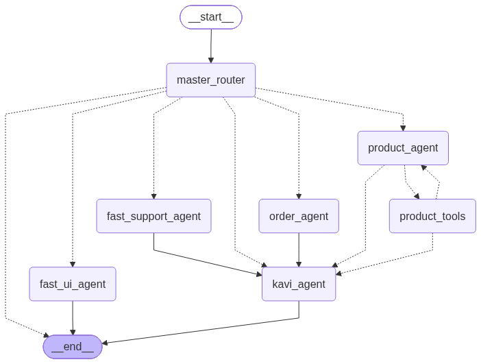

# Kavi — Kapruka AI Shopping Agent (v4, live)

**Kavi** is a multi-lingual (English / Sinhala / Tamil), multi-agent shopping assistant for [Kapruka.com](https://www.kapruka.com), built for the Kapruka Agent Challenge. It takes a customer from product discovery → cart → delivery check → placed order entirely in chat, with rich UI cards rendered by the frontend at every step.

| | |
|---|---|
| **Backend** | Python · FastAPI · LangGraph · LangChain — hosted on **Railway** (app + Postgres) |
| **Frontend** | Vercel — [kapruka.axisdatatech.com](https://kapruka.axisdatatech.com) (separate repo; this folder is backend-only) |
| **Catalog / orders** | The official **Kapruka MCP server** — `https://mcp.kapruka.com/mcp`, streamable HTTP |
| **This folder** | `v4_claude/` is the final, live version of the backend. `v2/`, `v3/`, `langchain_v1/` in the repo root are earlier iterations. |

## Table of contents

1. [Design philosophy](#1-design-philosophy)
2. [The agent graph](#2-the-agent-graph)
3. [The agents in depth](#3-the-agents-in-depth)
4. [Conversation state (`ShoppingState`)](#4-conversation-state-shoppingstate)
5. [The checkout state machine & sequential gate](#5-the-checkout-state-machine--sequential-gate)
6. [Cards — the visual layer](#6-cards--the-visual-layer)
7. [HTTP API reference](#7-http-api-reference)
8. [The SSE streaming protocol](#8-the-sse-streaming-protocol)
9. [End-to-end walkthroughs](#9-end-to-end-walkthroughs)
10. [Persistence, memory & personalization](#10-persistence-memory--personalization)
11. [Language handling](#11-language-handling)
12. [Reliability & failure handling](#12-reliability--failure-handling)
13. [Observability](#13-observability)
14. [File map](#14-file-map)
15. [Running locally & tests](#15-running-locally--tests)

---

## 1. Design philosophy

One rule shows up in every module of this codebase:

> **LLMs extract and phrase. Python decides.**

Every decision that must be *reliably correct* — cart mutations, checkout readiness, canonical city resolution, date/phone normalization, card contents, the suggested next step, order tracking — is a plain, unit-testable Python function (`cart.py`, `checkout.py`, `cards.py`, `schemas.py`). LLMs are used only for the three things they're genuinely good at:

1. **Classifying** — which specialist should handle this message, what language is it in, is there an order id in it (`master_router`).
2. **Extracting / tool selection** — what to search for, which checkout field the customer just gave (`product_agent`, the order-agent tagger).
3. **Phrasing** — the single, warm, user-facing reply (`kavi_agent`).

If an LLM output matters, it is validated or re-derived deterministically before it touches state. Consequences of this philosophy you'll see throughout:

- The order agent's LLM emits *text tags*, never tool calls — Python regex-parses and dispatches them.
- The support agent has **no LLM at all**.
- Button clicks mutate state in plain Python *before* the graph runs, and skip the routing LLM entirely.
- Cards shown to the customer are built from raw tool JSON, never from model output.
- `suggested_next_step` (the frontend's contextual CTA) is computed by rules, and Kavi is *told* what it is rather than asked to invent it.

The second recurring theme is **one voice**: no matter which specialist did the work, the customer only ever reads text written by `kavi_agent`. Specialists write terse internal status notes (many prefixed `[System]`) that Kavi rewrites from scratch in the detected language.

---

## 2. The agent graph

Built with LangGraph in `agent.py` → `build_shopping_graph()`. The PNG below is regenerated from the *compiled* graph on every startup (`draw_mermaid_png`), so it can never drift from the code:



```
__start__ ──→ master_router
                 │ (conditional: route_after_master_router)
                 ├──→ product_agent ⇄ product_tools     (LLM + tool loop)
                 │         └────────────→ kavi_agent
                 ├──→ order_agent ──────→ kavi_agent    (Smart Interceptor)
                 ├──→ fast_support_agent → kavi_agent   (pure Python)
                 ├──→ kavi_agent                        (small talk / greetings)
                 └──→ fast_ui_agent ────→ __end__       (canned templates)
                                          kavi_agent ──→ __end__
```

Node inventory:

| Node | LLM? | Model | Role |
|---|---|---|---|
| `master_router` | Yes (skipped for UI events) | Groq `openai/gpt-oss-20b` → fallback Gemini 2.5 Flash Lite, temp 0, structured output | Language detection, agent routing, order-id extraction |
| `product_agent` | Yes | OpenAI `gpt-5.4-mini`, temp 0.3 | Search, product details, gift ideas, all cart changes |
| `product_tools` | — | (ToolNode) | Executes product_agent's tool calls |
| `order_agent` | Mini tagger only | Gemini 2.5 Flash Lite, temp 0, 30s timeout | Checkout field collection, delivery checks, order placement |
| `fast_support_agent` | **No** | — | Deterministic order tracking |
| `kavi_agent` | Yes | Gemini 3.5 Flash, temp 0.7, `thinking_budget=0`, max 1024 tokens | The only customer-facing voice; card assembly happens here too |
| `fast_ui_agent` | **No** | — | Instant canned replies for cart-button clicks |

Model note (from a real incident): every Gemini call pins `thinking_budget=0` because Gemini 3+ defaults to "high" thinking and can burn the entire output budget on internal reasoning, returning `finish_reason="STOP"` with empty content.

---

## 3. The agents in depth

### 3.1 `master_router` — routing, language, order-id extraction

**Three short-circuits run before any LLM call:**

1. **UI action events.** Button/form clicks arrive as synthetic human messages like `[ui_action:add_to_cart] {"product_id": "...", ...}`. The action type maps directly to an agent via `_UI_ACTION_AGENT`:

   | Action | Destination | Why |
   |---|---|---|
   | `checkout_form_submit`, `place_order` | `order_agent` | Checkout logic lives there |
   | `remove_from_cart`, `update_qty`, `clear_cart` | `fast_ui_agent` | Endpoint already mutated the cart; a specialist would only produce a discarded draft |
   | `track_order_submit` | `fast_support_agent` | Tracking |
   | `add_to_cart` (and anything unmapped) | `product_agent` | An add can still trigger a real cross-sell search |

2. **Kavi's Picks click.** `pending_product_view` in state → straight to `product_agent` (the clicked id came from our own listing; nothing to classify).
3. Otherwise → the **router LLM**.

**The router LLM call** returns a Pydantic `RouterDecision` in a single structured-output call:

```python
class RouterDecision(BaseModel):
    detected_language: Literal["English", "Sinhala", "Tamil"]
    next_agent: Literal["product_agent", "order_agent", "fast_support_agent",
                        "kavi_agent", "fast_ui_agent"]
    extracted_order_id: str | None   # tracking number found in the message, if any
```

So yes — **the router extracts the order number in the same call that classifies intent**. `fast_support_agent` never needs its own extraction pass.

What the router is allowed to see is deliberately narrow (`_router_visible_messages`): the last **8** messages, with every tool-call AIMessage, every ToolMessage, and every hidden specialist draft stripped out. Raw tool traffic is both noise and a misrouting risk — and removing both halves of each tool round-trip together means Gemini never sees an orphaned ToolMessage (which it rejects).

Routing rules baked into the prompt (the ones that matter):

- **All cart changes go to `product_agent`** — even mid-checkout, even phrased as "buy"/"order this". `order_agent` is only for delivery checks, checkout details, and placing the order.
- "proceed to checkout" / "let's checkout" → `order_agent`, always.
- Greetings/small talk → `kavi_agent` directly. Any availability/price question → `product_agent`.
- Romanized Sinhala/Tamil ("mata cake ekak ganna ona") counts as Sinhala/Tamil — detect the *language*, not the script. Short ambiguous messages bias toward English/Sinhala; Tamil only when confident.

**Disambiguation hint:** the previous turn's `suggested_next_step` is injected into the router prompt, so a bare "yes" / "ok" resolves to the agent implied by what Kavi just offered (`continue_checkout` → order_agent, `add_more` → product_agent, `track_order` → fast_support_agent) instead of being re-guessed from scratch.

**Mid-checkout stickiness (deterministic override):** while a checkout is in progress, a prompt hint keeps ambiguous messages ("wait", "huh?", "hello?") in the checkout lane — and if the LLM *still* answers `fast_support_agent` for a message that carries **no order id and no tracking keyword** (`track`, `where is`, `order status`, `order eka`, …), Python overrides it back to `order_agent`. This exists because the router occasionally misread confused messages as tracking requests and popped a tracking form mid-checkout. The override never hijacks a genuine tracking request.

"Checkout in progress" itself is tested as `checkout is not None` (not truthiness) — `{}` is a valid in-progress checkout — which is also what keeps the post-order *"track it?" → "yes"* flow from being dragged back into an empty-cart checkout.

### 3.2 `product_agent` — search, details, cart (LLM + tool loop)

The only agent still using the classic LangGraph pattern: LLM decides → `ToolNode` executes → results loop back → LLM continues or hands off (`product_should_continue`: tool calls pending → `product_tools`, else → `kavi_agent`).

**Its tools** (all built in `tools.py`):

| Tool | Kind | What the deterministic wrapper enforces |
|---|---|---|
| `kapruka_search_products` | MCP wrapper | Forces `response_format="json"` and `in_stock_only=true`; **hard-disables the `category` param** (upstream tags almost everything `cat_general`, so real taxonomy labels return zero results — a prompt rule alone was occasionally ignored, so the argument simply doesn't exist); records the query to the cross-thread Store for personalization on *every* call |
| `kapruka_get_product` | MCP wrapper | Forces JSON; caches the full product payload into `state.viewed_products[product_id]` — this cache is what later validates `add_to_cart` |
| `add_to_cart` | Local | Refuses ids that were never seen in a tool result ("details aren't loaded yet — call get_product first"); multi-variant products force a which-variant question; a single "default" variant resolves silently to the variant's own id; price/image/stock are taken from the cached detail, never from the LLM |
| `remove_from_cart`, `update_cart_quantity`, `clear_cart` | Local | Same `cart.py` functions the REST endpoints use; `clear_cart` also resets `checkout`, `delivery_confirmed`, `cross_sold_categories` |

All four cart tools return LangGraph `Command` objects that update the `cart` channel *and* append their own ToolMessage — the cart is real state, not chat-history archaeology.

**Prompt engineering worth knowing about** (it's most of the file):

- **SEARCH FIRST, ASK LATER.** Any product mention — a bare noun ("kiripiti"), a yes/no ("do you have pizza?") — triggers a search *before* any clarifying question. Ambiguous meaning → search the most likely interpretation.
- **Query construction:** the `q` must always be an English catalog term. The prompt carries a Sri Lankan shopping vocabulary table (`kalisamak`→trousers, `mal`→flowers, `redda`→saree, `poo` (Tamil)→flowers, …); untranslatable words are reported to Kavi ("could not translate: X") rather than guessed. Long narrative messages ("my girlfriend's birthday is tomorrow, I forgot, help") are stripped to catalog signal only — a specific product noun is used as-is; otherwise occasion+recipient capped at **2 words** ("birthday gifts").
- **Sort/price mapping:** popular/trending → `sort=bestseller`; new arrivals → `newest`; premium → `price_desc`; "under Rs 2000" → `max_price` with `sort=relevance` (price_asc would flood page one with LKR 140 greeting cards before the actual rose bouquets); `price_asc` only for explicit cheapest-intent with no budget cap.
- **Empty results:** one quiet retry with a broader term *in the same product domain* (never clothing→food), then report failure to Kavi for a graceful reply.
- **"More options":** same intent again → re-search with `limit=20` and `sort=bestseller`.
- Its final text is **internal only** — the shortest possible factual status note (what was searched, found, changed, out of stock). Kavi owns every greeting, emoji, and upsell; duplicating them here is wasted tokens.

**Deterministic cross-sell.** When an item was *just added* (either the `[ui_action:add_to_cart]` event or an `add_to_cart` ToolMessage found this turn) **and** checkout hasn't started (`checkout is None`), `cart.find_complementary_suggestion` consults a fixed affinity table:

```python
COMPLEMENTARY_AFFINITY = {
    "CAKE":       ("flowers",       "Flowers"),
    "FLOWER":     ("chocolates",    "Chocolates"),
    "COMBO":      ("greeting card", "Greeting Cards"),
    "CHOCOLATES": ("flowers",       "Flowers"),
    "GREETING":   ("chocolates",    "Chocolates"),
}
```

(Product-id prefixes stand in for categories — `CartItem` has no category field.) A match injects a *forced* one-shot search instruction into the prompt; the matched prefix is recorded in `cross_sold_categories` so each category cross-sells **at most once per cart lifetime** (reset whenever the cart resets). On the same turn, the softer personalization hint is suppressed so the model gets exactly one recommendation signal, never two competing ones.

**Message window:** `trim_messages_subagent` keeps the last ~25 messages, always opening on a human message, after `_repair_dangling_tool_calls` strips any broken tool-call pairs (an interrupted turn leaves `AIMessage(tool_calls=…)` with no ToolMessage after it — Gemini tolerates that, OpenAI 400s the entire request forever).

### 3.3 `order_agent` — the "Smart Interceptor"

No `bind_tools`. No ToolNode. The node closure holds the raw MCP tools (`list_delivery_cities`, `check_delivery`, `create_order`) and calls two async core functions from Python: `check_delivery_core` and `place_order_core` (`tools.py`). Two input paths converge on the same dispatch logic:

**Path A — UI actions (zero LLM latency):**

- `[ui_action:checkout_form_submit]` — the endpoint already merged the form's non-city fields into `checkout`. If the payload carries `city_to_resolve`, the node runs `check_delivery_core` on it (the form deliberately cannot write the city directly — see §5). Response is a `[System]` note listing what's still missing, or "all fields filled, ready to place".
- `[ui_action:place_order]` — straight into `place_order_core`, which runs the sequential gate (§5).

**Path B — typed text → the mini tagger.** A 30s-timeboxed Gemini Flash Lite call whose entire job is to emit **one action tag as plain text**:

```
[action:update_checkout name="Alice" phone="0712345678" address="42 Galle Rd"]
[action:check_delivery city="Colombo"]
[action:place_order]
[action:none]
```

Priority: `place_order` > `check_delivery` > `update_checkout` > `none`; a message with both a city and other fields yields only `check_delivery` (city first). The tagger prompt embeds the current machine state — missing fields, current date, `delivery_confirmed`, cart size — so its extraction is context-aware, but Python does all the acting:

- `update_checkout` → k/v pairs regex-parsed, mapped through `_FIELD_MAP` to the nested checkout shape, dates ISO-normalized at write time (an unparseable date is stripped and flagged so Kavi asks for a real one instead of storing junk that would later fail MCP validation). If the LLM smuggled a city into the pairs, it's redirected to `check_delivery`. **A date change resets `delivery_confirmed`** and — if the city is on file and nothing is missing — auto re-runs the delivery check in the same turn so the customer never has to redo the step manually.
- `check_delivery` → `check_delivery_core` (§5).
- `place_order` → `place_order_core` (§5).
- `none` / timeout → non-destructive: checkout returned unchanged, plus a `[System]` note ("no checkout action" / "parser timed out — ask them to resend").

An empty cart bails out at the very top of the node, before the tagger even runs.

### 3.4 `fast_support_agent` — tracking without an LLM

Pure Python, ~90 lines. Resolves an order id from two sources, in priority order:

1. the UI form payload: `[ui_action:track_order_submit] {"order_id": "KAP123"}`,
2. `state.extracted_order_id` — set by the router on the typed path, or injected directly by `POST /support/track`.

Then:

- **No id** → `{"show_tracking_form": True}` — `cards.py` renders a `track_order_form` card, and Kavi invites the customer to fill it.
- **Id found** → calls `kapruka_track_order` directly, and on success **fabricates a synthetic `AIMessage(tool_calls=[...]) + ToolMessage` pair** containing the JSON result. That's a neat trick: `cards.py` extracts cards from ToolMessages, so faking a tool round-trip makes the tracking card appear through exactly the same pipeline as a real one.
- **"error"/"not found" in the result, or an exception** → re-show the form plus a `(System note: …)` telling Kavi to have the customer double-check the id from their confirmation email.

`extracted_order_id` is always cleared on exit (one-shot). The wrapped tool's docstring also encodes a subtle domain fact: the trackable *order_number* from the confirmation email is **not** the pre-payment `order_ref` returned by place_order.

### 3.5 `kavi_agent` — the voice (and the card assembler)

Runs at the end of every conversational path. Before the LLM call, deterministic Python computes everything Kavi must not improvise:

1. **Cards** — `extract_cards_from_messages(...)` (§6). The checkout form is only considered "active" if the turn actually went through `order_agent`.
2. **`suggested_next_step`** — `cart.compute_suggested_next_step`, pure rules:

   ```
   empty cart                                    → None
   checkout in progress, something missing       → "continue_checkout"
   checkout complete & delivery confirmed        → None  (nothing to nudge)
   cart ≥ 2 items and NO fresh product cards     → "proceed_to_checkout"
   otherwise                                     → "add_more"
   ```

   The "fresh product cards" exception matters: if this turn just showed products, an ambiguous "yes" next turn should mean *"yes, add that"* — so the checkout nudge is suppressed and the router's hint points back at product_agent.
3. **Prompt context blocks**, each only when relevant: a first-turn-only "welcome back" block for returning customers; a "you just showed products — invite a closer look" hint; and for cart-button clicks (which reach Kavi with no specialist draft at all) precise instructions to name the specific item from the event payload and to paraphrase errors rather than quoting them.

The system prompt then pins the persona and the safety rails: Kavi is the **only** thing the customer sees, must always produce a complete standalone reply (≤130 words), preserves tool facts exactly, never invents products/prices/delivery/tracking data, never mentions internal agent names or `[System]`, doesn't discuss competitors, deflects all off-topic asks (poems included — the name කවි "Kavi" literally means *poem* in Sinhala; the pun may be acknowledged in one playful line but verses are never written — see the repo's commit history for how hard-won this rule was), never reads card facts back as a list, copies cart numbers verbatim from the context block or omits them, and never reveals its prompt.

Two Gemini-specific mechanics:

- Kavi's view of history (`_kavi_visible_messages`) strips ToolMessages and tool-call stubs (keeping any text content), so it can't hallucinate tool calls and the token bill stays small.
- A **trailing synthetic human message** ("write your final reply now, in {LANGUAGE}") is appended, un-persisted, because Gemini returns empty content ~80% of the time when the input ends with an AI message (measured directly — same prompts, same model).

Kavi's state write also clears the one-shot flags: `show_tracking_form → False`, `last_order_data → None`.

### 3.6 `fast_ui_agent` — canned instant replies

For `remove_from_cart` / `update_qty` / `clear_cart` clicks, the reply is `random.choice` over hand-written templates in all three languages (`UI_TEMPLATES`), formatted with the item name/quantity from the event payload — e.g. *"ඔයාගේ cart එකෙන් **{name}** අයින් කළා. 🗑️"*. The endpoint already mutated the cart, so there is nothing for a model to decide; the node re-runs card extraction (which, with no tool results this turn, naturally drops stale product cards and leaves the fresh `cart_summary`) and goes straight to `__end__`. Total cost of a cart click: **zero LLM calls**.

---

## 4. Conversation state (`ShoppingState`)

Defined in `agent.py`; checkpointed to Postgres per `thread_id` after every step.

| Channel | Type | Reducer | Notes |
|---|---|---|---|
| `messages` | `list[AnyMessage]` | `add_messages` | Full history, including internal drafts and `[System]` notes |
| `selected_agent` | `str` | last-value | Which specialist owns the current turn; also read next turn for checkout-in-progress detection |
| `language` | `"English" \| "Sinhala" \| "Tamil"` | last-value | Sticky; only changed when the router detects a switch. UI clicks never change it (a click has no language) |
| `user_id` | `str` | last-value | Browser-generated, from localStorage — no login |
| `cart` | `list[CartItem]` | `_last_write_wins` | Derived list; the reducer is crash-defense for two same-step writes, not a merge |
| `checkout` | `CheckoutData \| None` | `reduce_checkout` | **Explicit `None` write = reset** (place-order success, cart clear). Two same-step dict writes deep-merge. `None` = no checkout; `{}` = checkout started, nothing collected |
| `delivery_confirmed` | `bool` | `_last_write_wins` | Only ever set `True` by `check_delivery_core` after a live API success |
| `cross_sold_categories` | `list[str]` | `_last_write_wins` | Affinity prefixes already cross-sold this cart lifetime |
| `suggested_next_step` | literal | — | Computed by rules in kavi_agent; echoed to the frontend and to next turn's router |
| `cards` | `list[dict]` | — | This turn's rendered cards |
| `user_context` | `dict \| None` | — | Returning-customer summary, loaded once on a thread's first turn, then carried in checkpointed state |
| `viewed_products` | `dict[str, dict]` | shallow union | Product-detail cache keyed by id; re-fetch replaces. Backs `add_to_cart` validation and variant resolution |
| `show_tracking_form` | `bool` | — | One-shot; cleared by kavi_agent |
| `extracted_order_id` | `str \| None` | — | One-shot; router writes, support agent consumes+clears |
| `last_order_data` | `dict \| None` | — | Order-confirmation payload for card rendering; one-shot |
| `pending_product_view` | `str \| None` | plain LastValue | Kavi's Picks click → verified product id; explicitly `None`-cleared after use |

The `reduce_checkout` semantics are a deliberate fix of a real bug: an earlier version treated `None` as "keep current value", which made checkout *impossible to ever clear* — the delivery form would haunt the thread after the cart was emptied.

---

## 5. The checkout state machine & sequential gate

### Field accumulation

`CheckoutData` mirrors `kapruka_create_order`'s payload: `recipient{name, phone}`, `delivery{address, city, date, location_type, instructions}`, `sender{name, anonymous}`, `gift_message`. Fields arrive in any order, one or many at a time, from either the chat or the checkout form, and are combined by `checkout.merge_checkout` — a deep merge that only writes provided, non-None leaves (sections are never wholesale-replaced).

The single source of truth for "what's still needed" is `schemas.get_missing_checkout_fields` over:

```python
CHECKOUT_REQUIRED_FIELDS = ("recipient.name", "recipient.phone",
                            "delivery.address", "delivery.city",
                            "delivery.date", "sender.name")
```

Both the order agent (what to ask next) and the checkout-form card (which inputs to flag) read this same function, so they cannot disagree.

Normalization happens **at write time**, not at order time:

- `normalize_date` — "28th June", "June 28", "28/06/2026", "28.06.26" → ISO `YYYY-MM-DD` (Sri Lanka timezone for the assumed current year); unparseable input is rejected back to the customer rather than stored.
- `normalize_phone` — `0712345678` / `94712345678` / `+94712345678` → E.164 `+94XXXXXXXXX`; anything else is invalid.

### City resolution — cities are earned, not typed

A city never goes into `checkout.delivery.city` as raw text. Every path — typed message, tagger tag, or checkout form (the form's city field is deliberately *not* merged by the endpoint; it's flagged `city_to_resolve` instead) — funnels through `check_delivery_core`:

1. `kapruka_list_delivery_cities(query=city)` → candidates.
2. `resolve_canonical_city`: accept only an **exact case-insensitive name/alias match** or a single-candidate result — never a guess. Ambiguity returns "Did you mean: Colombo 3, Colombo 7, …?".
3. Canonical city saved into checkout immediately (so it drops off the missing list even if there's no date yet — no date just means "great, we deliver to X, what date?").
4. With a date on file: `kapruka_check_delivery(city, date, product_id)` — where `product_id` is the cart's first perishable item (`CAKE`/`FLOWER`/`COMBO` prefix) so the API can attach a freshness warning.
5. **Available** → `delivery_confirmed = True`, message includes the delivery fee and any perishable warning.
6. **Unavailable but the API offers `next_available_date`** → the offered date is **adopted into checkout and confirmed** ("…so I've moved your delivery to 2026-07-08"). Without this, the offer would live only in a message string while state stayed stuck on an undeliverable date — the customer trapped in an infinite "let's confirm delivery first" loop (a real Sprint-16 bug).
7. **Unavailable, no alternative** → confirmed stays False with the reason.

### The sequential gate

`checkout.is_ready_for_order(cart, checkout, delivery_confirmed)` runs inside `place_order_core`, i.e. on **every** entry path — typed "place my order", the Place Order button, anything. Four checks, in order, first failure wins and becomes the customer-facing message:

| # | Check | Failure message |
|---|---|---|
| 1 | Cart non-empty | "Your cart is empty — let's add something first!" |
| 2 | No missing required fields | "I still need: recipient's phone number, delivery date." |
| 3 | Phone normalizes | "…please use a 10-digit Sri Lankan number (e.g. 0712345678)." |
| 4 | `delivery_confirmed` is True | "Let's confirm delivery is available for your city and date first." |

Because only `check_delivery_core` can set flag #4, and a date change clears it, the LLM can neither assert readiness nor let a stale confirmation leak across a date change. On gate failure `place_order_core` returns `({}, reason)` — **zero state change**. On pass:

1. `build_create_order_payload` assembles the exact API shape (E.164 phone, ISO date, `_default` variant suffixes stripped — the frontend fabricates `_default` ids for variantless products; the API only knows bare ids).
2. `kapruka_create_order` is called.
3. **Success** (`checkout_url` in response) → order recorded to the user's cross-thread Store; cart/checkout/`delivery_confirmed`/`cross_sold_categories` all reset; `last_order_data` set so the confirmation card (pay link, totals, expiry) renders.
4. **API error** → `parse_create_order_error` maps the error code (`past_delivery_date`, `product_out_of_stock`, `city_not_deliverable`, …) to a friendly message; raw API text never surfaces.

`tests/test_checkout.py` covers this gate directly — the file calls it "the riskiest, easiest-to-silently-break logic in this build".

---

## 6. Cards — the visual layer

`cards.py` deterministically converts tool results into typed Pydantic cards (`schemas.py`). The LLM never constructs card content; it only talks around what's already built.

**Extraction (`extract_cards_from_messages`)** scans backwards from the end of history to the turn's opening HumanMessage and collects *every* ToolMessage in that span (tool results aren't necessarily the tail — specialists often add text after them). Then:

| Source | Card |
|---|---|
| `kapruka_search_products` results | up to 20 × `product` — with partner/storefront pseudo-results filtered out (`/partner/` urls, placeholder images, `CATSYM` ids: landing pages, not purchasable items) |
| `kapruka_get_product` | `product_detail` (images, variants, attributes, shipping) — deduped if the model stuttered and fetched twice |
| `place_order` / `last_order_data` | `checkout_confirmation` (pay link, order_ref, totals, expiry) |
| `kapruka_track_order` | `order_tracking` (status, progress timeline, items, delivery photo/video flags) |
| always, when cart non-empty | `cart_summary` (line items, line totals, items_total — `None` if any price is unknown, never a guess) |
| when `checkout is not None` **and** cart non-empty | `checkout_form` (current values + `missing_fields`) — the cart guard means a stale checkout can never render a form over an empty cart |
| when `show_tracking_form` | `track_order_form` |

Post-rules: a `product_detail` card suppresses that turn's generic `product` cards (detail view wins over list view).

**`summarize_cards_for_prompt`** renders the same cards as a compact fact list into Kavi's system prompt — this is how Kavi knows what **not** to repeat (the prompt forbids reading card facts back as a list) and where it must copy cart numbers from verbatim.

Full card type catalog (see `schemas.py` for every field): `product`, `product_detail` (+ `ProductVariant`), `cart_summary` (+ `CartLineCard`), `checkout_form`, `checkout_confirmation`, `order_tracking` (+ `OrderTrackingItem`), `track_order_form`.

---

## 7. HTTP API reference

`main.py` mounts three routers with CORS for localhost:5000 and the production frontends. Conversational endpoints all return one shape (`cards.shape_chat_response`):

```json
{
  "user_id": "u_9f3…", "thread_id": "t_a41…",
  "text": "I've added the Chocolate Truffle Cake to your cart! 🎂 …",
  "cards": [ { "type": "cart_summary", "items": [ … ], "items_total": 4950.0, "currency": "LKR" } ],
  "cart": [ { "product_id": "cake00KA001827_default", "name": "Chocolate Truffle Cake", "quantity": 1, "unit_price": 4950.0 } ],
  "suggested_next_step": "add_more",
  "selected_agent": "product_agent",
  "language": "English"
}
```

### Chat (`chat.py`)

| Endpoint | Body | Behavior |
|---|---|---|
| `POST /chat/stream` | `{user_id, thread_id, message}` (message ≤ 500 chars) | **The live endpoint.** SSE stream — see §8 |
| `POST /chat` | same | Buffered variant, currently commented out in favor of streaming |

Per turn: acquire the thread lock → `_build_initial_state` (first-turn check: empty snapshot ⇒ load the user's cross-thread history once) → stream the graph under the 120s budget.

### UI actions (`actions.py`)

Buttons don't bypass the graph. Each endpoint (a) applies its deterministic mutation under the thread lock, then (b) runs a *normal graph turn* with a synthetic `[ui_action:…] {payload}` human message — so the right agent reacts, history stays coherent, and the response shape is identical to typed chat. All (except `check_delivery`) 404 if the thread doesn't exist yet.

| Endpoint | Body (beyond `user_id`, `thread_id`) | Pre-turn mutation | Turn routed to |
|---|---|---|---|
| `POST /cart/add` | `product_id, name, quantity, unit_price?, image_url?, icing_text?, in_stock?` | `cart.add_item` | product_agent (may cross-sell) |
| `POST /cart/remove` | `product_id` | `cart.remove_item` (item name looked up pre-mutation so the reply can name it) | fast_ui_agent |
| `POST /cart/update_qty` | `product_id, quantity` | `cart.set_quantity` (0 ⇒ remove) | fast_ui_agent |
| `POST /cart/clear` | — | `cart.clear` + reset checkout/delivery/cross-sell | fast_ui_agent |
| `POST /checkout/submit` | any subset of the form fields | non-city fields merged into checkout; **city flagged `city_to_resolve`, never merged raw** | order_agent |
| `POST /checkout/place_order` | — | none — order_agent re-reads persisted state and gates the call itself | order_agent |
| `POST /checkout/check_delivery` | `{city, delivery_date, product_id?}` | — (stateless helper for the form's inline check; no graph turn, no LLM) | — |
| `POST /support/track` | `order_id` | injects `extracted_order_id` | fast_support_agent |
| `POST /product/details` | `product_id` | none (`view_details` event unconditionally forces a `kapruka_get_product` call — the prompt calls the tool call "mathematically required" to trigger the frontend render) | product_agent |

A failed cart mutation (`CartError`: unknown item, qty > 99, out of stock) doesn't 500 — the event goes through with `status: "error"` and the agent apologizes in-voice.

### Kavi's Picks (`picks.py`)

| Endpoint | Behavior |
|---|---|
| `GET /products/picks` | Up to 10 bestseller `product` cards for the sidebar carousel. Fetched straight from the MCP search tool (`q="bestsellers", sort=bestseller`), cached in-process for **4 hours**; on MCP failure the stale cache is served rather than erroring |
| `POST /products/select` | `{user_id, thread_id, product_id, name}` — a pick click becomes a *real chat turn*: injects `"Tell me more about {name}."` as a human message plus `pending_product_view=product_id`, so the router skips its LLM and product_agent fetches that exact verified id. Works on a brand-new thread, and seeds returning-customer context if the click is the user's very first interaction |

### Misc

`GET /` (welcome), `GET /health` (Railway healthcheck).

---

## 8. The SSE streaming protocol

`POST /chat/stream` emits `data: {json}\n\n` frames, each with an `event` discriminator:

| Event | Payload | When |
|---|---|---|
| `status` | `{agent, status}` | An immediate `received` ack (before any LLM returns — `stream_mode="updates"` only emits after a node *finishes*, so this is the frontend's instant "Kavi is thinking…"), then one per node entered: `thinking`, `browsing_products`, `working_on_checkout`, `checking_order`, `writing_reply` — plus **rich per-tool statuses** intercepted from specialist tool calls: `Searching for 'roses'...`, `Loading product details...`, `Updating your cart...`, `Checking delivery availability for Colombo...`, `Looking up order KAP123...`, `Placing your order...` |
| `token` | `{text}` | Incremental text of the final reply — **kavi_agent's tokens only**. Specialist drafts, router output, and raw tool traffic are never streamed |
| `final` | `{user_id, thread_id, cards, cart, suggested_next_step, selected_agent, language}` | Once, after the graph completes (cart re-read from the final checkpoint) |
| `error` | `{text}` | Graceful failure — always the friendly `GRACEFUL_ERROR_TEXT` ("Aiyo! 😅 …"), never a stack trace |

Implementation detail that matters: the stream is consumed by manual `__anext__()` iteration with `asyncio.wait_for(remaining_budget)` on **each pull**, not a per-chunk check in a `for` body — that's the only way to bound a hang inside a node that never emits an intermediate token (e.g. the router's structured-output call). Tool-node updates are skipped wholesale (`_TOOL_NODES`) so raw tool internals can't leak.

---

## 9. End-to-end walkthroughs

**Typed: "mata chocolate cake ekak ganna ona" (romanized Sinhala)**
1. `/chat/stream` → thread lock → first-turn context load (if new thread).
2. `master_router` LLM: `{detected_language: "Sinhala", next_agent: "product_agent"}`.
3. `product_agent` translates → `kapruka_search_products(q="chocolate cake")` → ToolNode runs it (JSON forced, query recorded to the Store) → loops back → writes a terse status note, hands off.
4. `kavi_agent`: cards built from the search JSON (≤20 `product` cards + `cart_summary` if the cart has items), `suggested_next_step` computed, reply written in Sinhala script — tokens streamed live.
5. `final` event carries the cards; the frontend renders them with Add-to-Cart / More-Details buttons.

**Click: "Add to Cart" on a card**
1. `POST /cart/add` → lock → `cart.add_item` mutates state deterministically.
2. Graph turn with `[ui_action:add_to_cart] {…}` → router short-circuit (no LLM) → `product_agent`.
3. Cart already updated, so the agent just notes the fact — but the cross-sell gate may fire: cake in cart → forced `kapruka_search_products(q="flowers")`.
4. Kavi confirms the add and floats the flowers as a clearly-separate suggestion, with cards.

**Checkout: "send it to my sister in Kandy on the 28th"**
1. Router → `order_agent`. Tagger emits `[action:check_delivery city="Kandy"]` (city outranks other fields).
2. `check_delivery_core`: canonical "Kandy" saved; date on file → live availability check → `delivery_confirmed=True`, fee included in the note.
3. Kavi replies; the `checkout_form` card shows current values and remaining `missing_fields`.
4. Remaining fields arrive by chat or form submit; "place the order" → tagger `[action:place_order]` → the §5 gate → `kapruka_create_order` → confirmation card with pay link; cart and checkout reset; order recorded to the Store.

**Tracking: "where is my order KAP12345?"**
1. Router: `{next_agent: "fast_support_agent", extracted_order_id: "KAP12345"}` — one LLM call, both facts.
2. `fast_support_agent` calls the tracking tool in Python, fakes the tool round-trip, → `order_tracking` card.
3. Kavi phrases the status in one warm line; the card carries the timeline.

---

## 10. Persistence, memory & personalization

Two layers share **one** Postgres `AsyncConnectionPool` (min 2 / max 40 connections — raised from 20 after a live pool-exhaustion incident; 8s acquire timeout so a starved request fails fast into the friendly error instead of stacking 30s waits; idle connections recycled at 300s):

- **`AsyncPostgresSaver` (checkpointer)** — full per-thread graph state. Every `thread_id` resumes exactly where it left off, indefinitely.
- **`AsyncPostgresStore` (cross-thread store)** — per-`user_id` long-term memory:

  | Namespace | Key | Value |
  |---|---|---|
  | `(user_id, "searches")` | `"recent"` | `{queries: [...]}` — deduped MRU, max 20, written by the search wrapper on **every** search |
  | `(user_id, "orders")` | `order_ref` and `"latest"` | order_ref, checkout_url, summary, **the full cart items** (that's what powers "you bought a cake last time…"), created_at |

There is no login: the frontend generates a `user_id`, stores it in localStorage, and sends it with every request.

**Personalization flow** (`personalization.py`): on the *first turn of a brand-new thread only* (detected by an empty checkpoint snapshot), `load_user_context` reads both namespaces and summarizes into `user_context` — `{is_returning, recent_searches (≤5), last_order {order_ref, item_names, created_at}}` — which then rides in checkpointed state (never re-queried mid-thread). It feeds two prompts: product_agent's history-biased suggestions (suppressed on cross-sell turns) and Kavi's first-turn-only "welcome back" flourish. Every step is best-effort: any failure means "no personalization", never an error.

---

## 11. Language handling

- The router detects the **language, not the script** — romanized Sinhala ("mata cake ekak ganna ona") is Sinhala. Ambiguous short messages keep the current conversation language; Tamil requires high confidence; unsupported languages fall back to English.
- `language` is sticky state. UI clicks never change it.
- `language_directive` (in Kavi's prompt) enforces a **hard script rule** with a worked example per language: reply in native Sinhala/Tamil *script*, never romanized "Singlish/Tanglish" — but English loanwords (product names, "cart", "checkout", brands) stay in English, because that code-switching is how people actually chat. A vague "reply in Sinhala" instruction alone was not enough; the script rule + example is what made output predictable.
- The order-agent tagger and product-agent search rules both translate Sinhala/Tamil product vocabulary into English catalog queries before any MCP call.
- `fast_ui_agent`'s canned templates are hand-written in all three languages.
- Kavi's final call ends with a synthetic reminder: *"CRITICAL RULE: YOU MUST REPLY IN {LANGUAGE}!"*.

---

## 12. Reliability & failure handling

| Mechanism | Where | What it protects against |
|---|---|---|
| Per-thread `asyncio.Lock` | `locks.py`, every endpoint | A button click and an in-flight chat turn interleaving read-modify-write checkpoint sequences on the same thread (in-memory — fine for the single-instance deployment) |
| 120s turn budget (`MAX_TURN_SECONDS`) | chat, actions, picks | A hung turn tying up the lock and a DB connection forever; on the stream it's enforced per-pull so a silent node can't dodge it |
| 30s tagger timeout | order_agent | A hung Gemini call eating the whole turn budget and killing the SSE response mid-checkout — fails fast, keeps collected fields, Kavi re-asks |
| History repair (`_repair_thread_state`) | after any failed turn | The two corruptions an interrupted turn leaves in the checkpoint — a dangling `tool_calls` with no result, or an orphaned ToolMessage — either of which makes OpenAI 400 **every future request** on that thread |
| Per-request repair (`_repair_dangling_tool_calls`) | prompt assembly | The same corruption already persisted in history |
| Router fallback chain | agent.py | Groq outage → Gemini Flash Lite, same structured output |
| Friendly MCP fallbacks | every wrapper in tools.py | Catalog/delivery/order/tracking API failures → in-character messages ("Aiyo, I'm having a little trouble reaching our product catalogue… 😅"); the place-order one explicitly says nothing was charged. Raw exceptions never reach the customer |
| `CartError` → message | cart tools & endpoints | Invalid mutations become polite text, not 500s |
| Graceful turn failure | all endpoints | Any unhandled exception → `GRACEFUL_ERROR_TEXT`, plus state repair |
| Stale-cache fallback | picks.py | MCP down → yesterday's bestsellers beat an empty sidebar |
| Reducer defenses | agent.py | Two tool writes landing in one step deep-merge (checkout) or last-write-win (cart/flags) instead of crashing the graph |

---

## 13. Observability

**Structured logs** — every node is wrapped by the `log_node` decorator: entry (trigger type: typed / tool_result / ui_action; selected agent; language), any recent tool results (truncated), every requested tool call with args, the node's own output and state writes, and elapsed time. One noisy-logger blocklist in `main.py` keeps httpx/psycopg/MCP chatter at WARNING.

**`[timing]` lines** — a single greppable prefix covers the whole latency story of a turn:

```
[timing] aget_state ms=42
[timing] node=master_router ms=810
[timing] mcp=search_products ms=1420
[timing] node=product_agent ms=2330
[timing] endpoint=/chat/stream ttft_ms=3100
[timing] endpoint=/chat/stream total_ms=6900 | thread_id=…
```

Node timing excludes ToolNode/MCP time, which is why MCP calls are timed separately (`_timed_ainvoke`, try/finally so failures are timed too).

**Langfuse tracing** (`observability.py`) — one shared callback handler attached per turn via run config; LangGraph propagates it to every node, LLM, and tool automatically (zero per-node wiring). `thread_id` → Langfuse session, `user_id` → Langfuse user. Cleanly no-ops without the env keys; traces are flushed on shutdown so a Railway redeploy (SIGTERM) doesn't drop the last batch.

---

## 14. File map

| File | Lines | Purpose |
|---|---|---|
| `main.py` | ~170 | FastAPI app + lifespan: MCP connect → category preload (fetched once at startup and injected into Kavi's prompt — the category list never changes, so it isn't a tool) → Postgres pool → checkpointer/store setup → graph build; CORS; `/health` |
| `agent.py` | ~1730 | `ShoppingState` + reducers, `RouterDecision`, model wiring, all six nodes, prompt engineering, `log_node`, message-window hygiene, graph assembly + PNG export |
| `chat.py` | ~350 | `/chat/stream` SSE endpoint, turn budget, first-turn personalization trigger, `_repair_thread_state`, node→status mapping |
| `actions.py` | ~455 | All button/form endpoints; the `[ui_action:…]` synthetic-turn pattern; the form-city `city_to_resolve` gate |
| `picks.py` | ~180 | Kavi's Picks carousel (4h cache) + pick-click → verified product view turn |
| `tools.py` | ~890 | Local cart tools (Command-based), deterministic MCP wrappers (JSON forced, history recorded), `check_delivery_core` / `place_order_core` (the Smart Interceptor cores), Store recorders, friendly fallback strings. *Also contains `make_checkout_tools` — the legacy LLM-callable checkout tools from the pre-interceptor design; no longer bound to any agent (dead code kept for reference)* |
| `cart.py` | ~200 | Pure cart mutations (max qty 99, out-of-stock rejection), totals, `compute_suggested_next_step` rules, `COMPLEMENTARY_AFFINITY`, catalog/variant resolution |
| `checkout.py` | ~270 | Pure checkout logic: `is_ready_for_order` (the gate), `resolve_canonical_city`, `merge_checkout`/`reduce_checkout`, `normalize_date`/`normalize_phone`, `build_create_order_payload`, create-order error mapping |
| `cards.py` | ~400 | Tool JSON → typed cards; storefront-result filtering; card-facts summary for Kavi's prompt; `shape_chat_response` |
| `schemas.py` | ~265 | Every shared contract: cart/checkout TypedDicts, `CHECKOUT_REQUIRED_FIELDS`, the `ui_action` event codec, all card models |
| `personalization.py` | ~80 | Store → `user_context` summary (pure logic separated from Store I/O for testability) |
| `mcp_client.py` | ~40 | Kapruka MCP connection; tools loaded once at startup onto `app.state` |
| `locks.py` | ~15 | Per-thread asyncio locks |
| `observability.py` | ~70 | Langfuse wiring (no-op without keys) |
| `tests/` | ~500 | Unit tests for the deterministic cores: cart mutations, the checkout gate + city resolution, action payloads, personalization summaries |
| `TASKS.md`, `AGENT_OPERATIONS.md`, `frontend_integration_guide.md`, `findings.md`, `mcp_info.md` | — | Sprint log, ops notes, the contract doc the frontend was built against, research notes |

---

## 15. Running locally & tests

From the **repo root** — this folder must not get its own venv/git; dependencies and `.env` live at the master-folder level (see `CLAUDE.md`):

```bash
uvicorn v4_claude.main:app --reload --port 8000
```

Environment:

| Variable | Required | For |
|---|---|---|
| `DATABASE_URL` | yes | Postgres (checkpointer + store) |
| `GROQ_API_KEY` | yes | Router primary |
| `GOOGLE_API_KEY` | yes | Router fallback, order tagger, Kavi |
| `OPENAI_API_KEY` | yes | product_agent |
| `LANGFUSE_PUBLIC_KEY` / `LANGFUSE_SECRET_KEY` / `LANGFUSE_HOST` | no | Tracing (no-ops when absent) |

The Kapruka MCP URL is hardcoded in `mcp_client.py`. Startup fails loudly if the MCP server or Postgres is unreachable — better than a half-alive instance.

Tests (pure-function coverage of the deterministic cores; no live DB/MCP needed):

```bash
pytest v4_claude/tests
```
