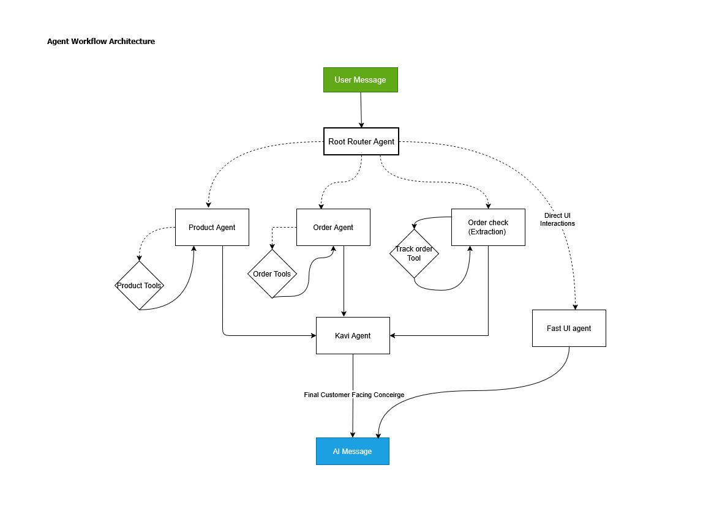

# Kaví - Kapruka-Shopping-Agent 🛍️

Meet Kaví- Your AI Assistant to the largest shopping marketplace in Sri Lanka. Powered by Kapruka MCP

Live at: https://kapruka.axisdatatech.com/

Kaví is an intelligent shopping companion that can help you find anything you like from thousands of live products available at Kapruka.com 

Kaví can search Kapruka's live catalog 🔍, understand English, Sinhala, Tamil, Singlish and Tanglish (Truly multilingual) 🗣️, remember user histories 📝, manage shopping carts 🛍️, guide customers all the way to checkout 💳, and even track existing orders 📦 ; all through natural conversation

### System Architecture

Technologies Used

Backend
Python , FastAPI , LangGraph , LangChain, Postgress, Iniitally Hosted on Railway - Currently self-hosted on a VPS

Frontend
HTML, CSS, JS (Free from Frameworks), Hosted on Vercel

### AI architecture

Though end users interact only one one chat interface, Kaví is build on a tiered multi-agent architecture. 

### Models used

- Router Agent Node : GPT OSS 20B using Groq, Fallback : Gemini 2.55-flash-lite
- Subagents
  Product agent - GPT-5.4-mini
  Order agent - Gemini-2.5 flash-lite

- Concierge Agent (Kavi Agent) - Gemini-3.5-flash

Every conversational path funnels through **kavi_agent**, the single voice the customer ever hears. Specialist agents write terse internal "status notes" that Kavi rewrites from scratch.

